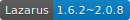
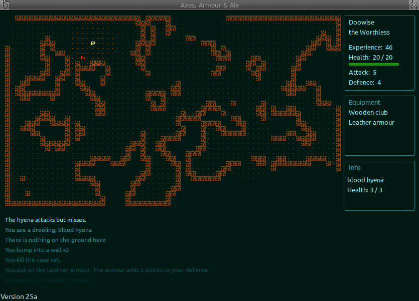
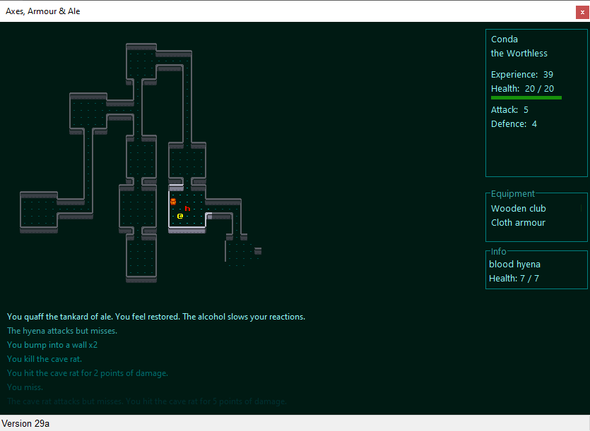

           

### A low-fantasy, roguelike game

Alpha version, most features aren't implemented yet and what there is may change frequently. Currently there are the following features:
 - A randomly generated dungeon and a cave created using cellular automata
 - Each game is automatically saved when exiting and can be reloaded when continuing
 - Saved games are deleted when the player dies
 - Game runs natively on both GNU/Linux and Windows
 - Small, self-contained binary with no external dependencies.
 - Can be run without needing to be installed

### Controls
Your character is controlled using either the numberpad or Vi keys.
<pre>
  y  k  u      7  8  9
   \ | /        \ | /
  h-   -l      4- 5 -6
   / | \        / | \
  b  j  n      1  2  3
  vi-keys      numpad

You can also move in cardinal directions using the arrow keys.
Pick up an item from the ground with either 'g' or ','
View inventory with 'i'
Drop an item with 'd'
Quaff / drink with 'q'
Wear armour or Wield a weapon with 'w'
To exit a menu / quit the game press ESCAPE

Use the mouse to click on enemies or items and the stats will display in the info box
</pre>

### documentation
Technical documentation can be found at https://cyberfilth.github.io/Axes-Armour-Ale/
