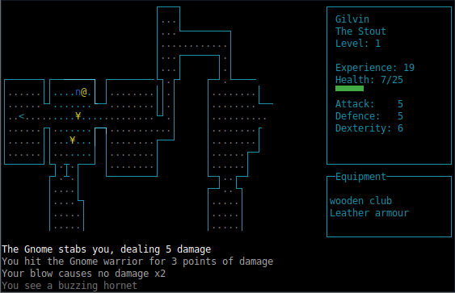

<h1 align="center">Axes, Armour & Ale</h1>

  

### A terminal-based, dungeon crawl game

Alpha version, most features aren't implemented yet and what there is may change frequently. Currently there are the following features:
 - Procedurally generated caves and dungeons
 - Game runs natively on GNU/Linux and Windows (also compiles for OSX)
 - Small, self-contained binary with no external dependencies.
 - Can be run without needing to be installed

The latest release can be downloaded from the [Releases page](https://github.com/cyberfilth/Axes-Armour-Ale/releases/tag/Alpha57)

### Controls
Your character is controlled using either the numberpad or Vi keys.
<pre>
  y  k  u      7  8  9
   \ | /        \ | /
  h-   -l      4- 5 -6
   / | \        / | \
  b  j  n      1  2  3
  vi-keys      numpad

You can also move in cardinal directions using the arrow keys.
Pick up an item from the ground with either 'g' or ','
View inventory with 'i'
Drop an item with 'd'
Quaff / drink with 'q'
Wear armour or Wield a weapon with 'w'
Zap magic with 'z'
To exit a menu / quit the game press ESCAPE (on Linux you will need to double-tap the ESCAPE key)
</pre>
 

   

Code documentation can be found at https://cyberfilth.github.io/Axes-Armour-Ale/intro.html
